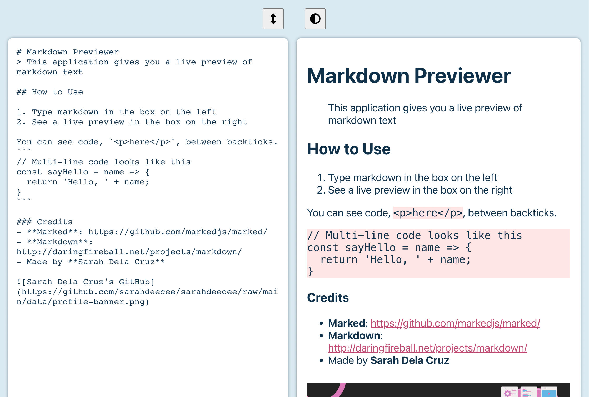
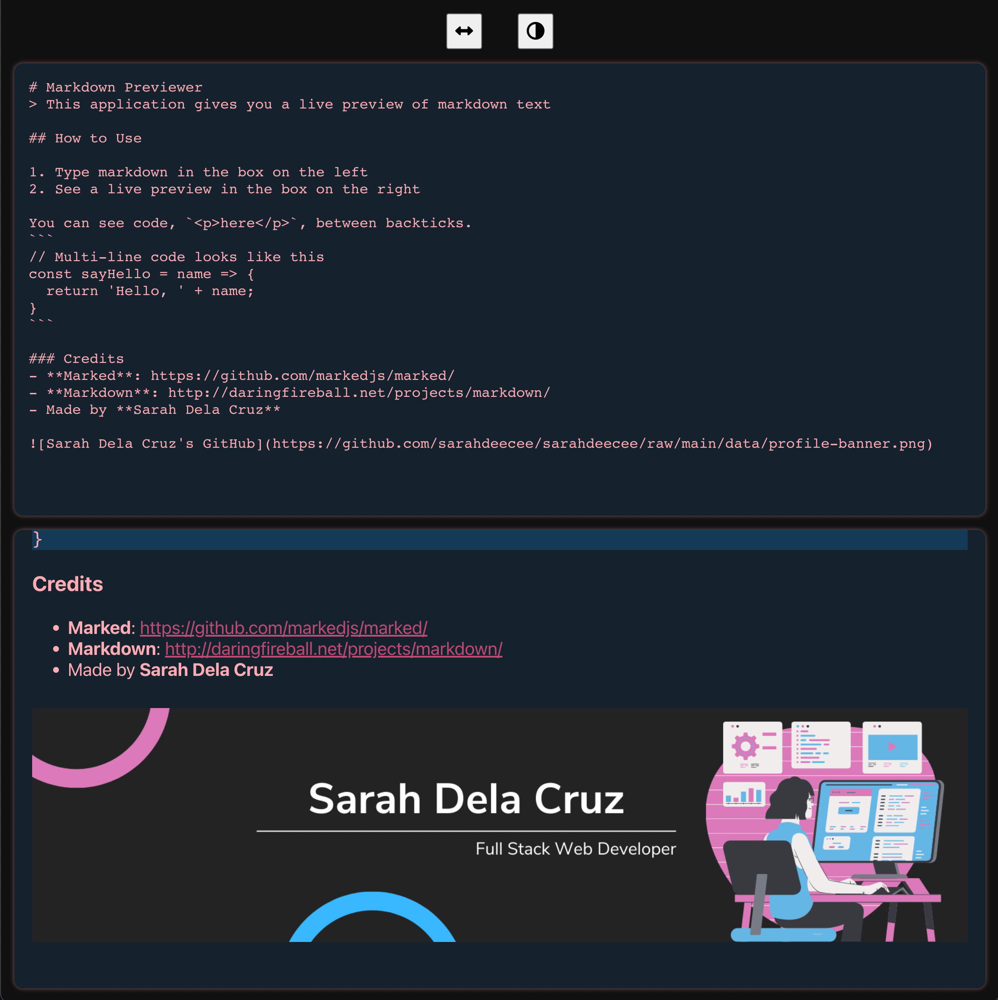

# Project 2 - Build a Markdown Previewer

## About
This application shows a live preview of markdown written in the textarea.
Features light and dark modes and horizontal or vertical viewing.

## Instructions
Create a CodePen.io app that passes all tests and fulfills the listed user stories.
Use any mix of HTML, JavaScript, CSS, Bootstrap, SASS, React, Redux, and jQuery to complete this project.

## Stack

## User Stories
| # | User Story | 
| --- | --- |
| #1 | I can see a `textarea` element with a corresponding `id="editor".` |
| #2 | I can see an element with a corresponding `id="preview"`. |
| #3 | When I enter text into the `#editor` element, the `#preview` element is updated as I type to display the content of the textarea. |
| #4 | When I enter GitHub flavored markdown into the `#editor` element, the text is rendered as HTML in the `#preview` element as I type (HINT: You don't need to parse Markdown yourself - you can import the Marked library for this: [Marked](https://cdnjs.com/libraries/marked). |
| #5 | When my markdown previewer first loads, the default text in the `#editor` field should contain valid markdown that represents at least one of each of the following elements: a heading element (H1 size), a sub heading element (H2 size), a link, inline code, a code block, a list item, a blockquote, an image, and bolded text. |
| #6 | When my markdown previewer first loads, the default markdown in the `#editor` field should be rendered as HTML in the `#preview` element. |
| Optional | My markdown previewer interprets carriage returns and renders them as `br` (line break) elements.

## Reference:
- [CodePen.io link](https://codepen.io/s_dc/pen/rNJqMvx)
- [Original instructions](https://www.freecodecamp.org/learn/front-end-development-libraries/front-end-development-libraries-projects/build-a-markdown-previewer)

## Credit
- Markdown: http://daringfireball.net/projects/markdown/
- Marked: https://github.com/markedjs/marked/